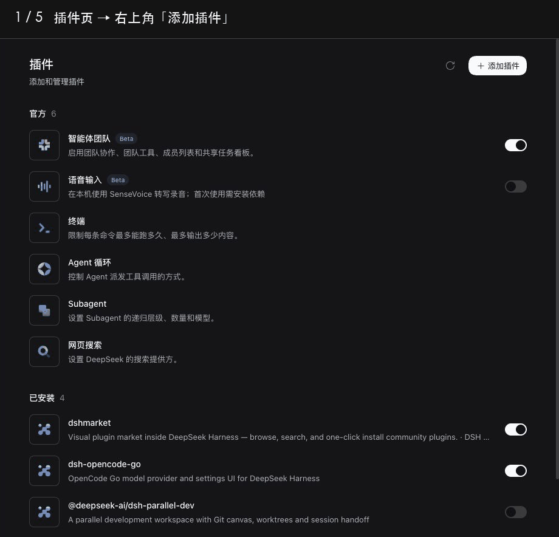
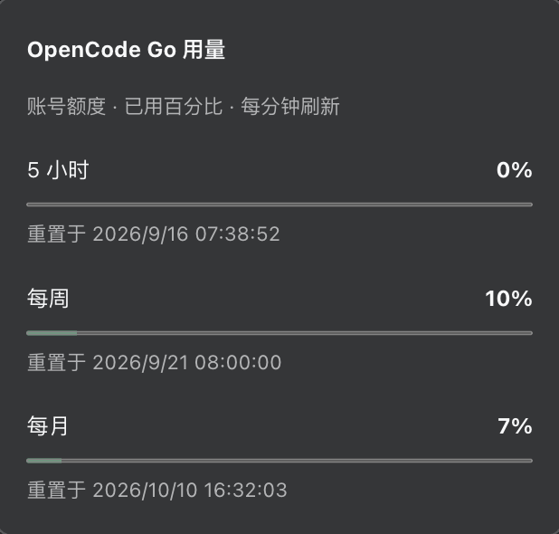

# dsh-opencode-go

[简体中文](README.md)

Use OpenCode Go subscription models in [DeepSeek Harness](https://github.com/deepseek-ai/deepseek-harness), with streaming, reasoning, tool calls, and image input. The plugin synchronizes model listings and limits, and provides multiple accounts, subscription usage, and proxy settings.

Requires DSH `0.1.5-rc.1` or later.

Installed compatibility is checked on ten host versions from `0.1.5-rc.1` through `0.2.1-alpha.1`; see the [compatibility matrix](docs/development.md#installed-package-matrix). Later hosts need verification. Developer messages, dynamic tool additions/removals, and deferred tool loading are explicitly rejected.

## Install

### From DSH

1. Open **Plugins → Add plugin**.
2. Enter `dsh-opencode-go` and click **Install**.
3. Click **Enable now** after installation.



You can also enter the Git repository URL when adding the plugin:

```text
https://github.com/Duskriver/dsh-opencode-go
```

### From the command line

```sh
dsh plugin --profile web add dsh-opencode-go
```

Start or restart `dsh web` after installation. Web and Headless use separate profiles; install and update each profile individually.

## Get started

1. Open **Settings → OpenCode Go**, enter your API key and save, or add an account in **Accounts**.
2. Select a model under **DSH OpenCode Go** in the conversation model picker.
3. Start chatting. Choose a reasoning level when offered, or attach images to a model that supports them.

Refresh the model list in Settings to synchronize the catalog. The switch beside each model controls its visibility in the picker and takes effect immediately. Context windows and output limits use catalog values by default; edit and save individual model limits as needed.

**Default** leaves reasoning to the service; **Off** explicitly disables it. Models with a switch show **On / Off**, models with adjustable effort show their supported levels, and budget-based models show token values.

Budget-based models offer common presets such as 1,024 / 2,048 / 8,192 / 16,384 tokens. Select a model in Settings, expand **Thinking budgets**, enter a value, click **Add**, then save to make that budget available in conversations. Allowed ranges vary by model; the SDK may reduce the actual budget to leave room for the answer.

The plugin follows DSH's interface language and supports English and Chinese.

### View subscription usage

Click the usage pill beside the conversation input to see the current account's five-hour, weekly, and monthly usage and reset times. Usage refreshes every minute and can also be refreshed manually.

Under **Advanced settings → Usage display**, choose:

- **Auto**: show usage while using this plugin's models; the default.
- **Always**: also show usage while using other models.
- **Off**: hide usage and stop polling.



### Manage multiple accounts

Use **Accounts** to add accounts, rename them, or replace keys. Expand an account row for detailed usage. Drag its handle to reorder accounts; the first account becomes the current one.

Enable **Auto switch** to try other accounts in list order when the current account runs out of quota or its key is unavailable, before output begins. To choose the account for subsequent requests directly, click **Switch** in the usage pill.

If adding or removing an account is interrupted by closing the page or losing the connection, the host resumes recovery at startup or after settings and credential updates. An addition whose key was never stored stays visible so you can replace its key or remove it. Recovery preserves a current-account choice made in the meantime.

## Advanced usage

### Headless mode

Install the plugin:

```sh
dsh plugin --profile headless add dsh-opencode-go
```

Save this as `headless.patch.yml`:

```yaml
- id: agent-default-model
  config:
    provider: dsh-opencode-go
    model: deepseek-v4.1-flash
```

Enter your key in Bash or Zsh, then run a task:

```sh
read -s OPENCODE_API_KEY
export OPENCODE_API_KEY
dsh --profile headless --patch ./headless.patch.yml "Hello"
```

Replace `model` with an available model ID from Settings. See [examples/headless.patch.yml](examples/headless.patch.yml).

### Network proxy

Open **Settings → OpenCode Go → Advanced settings → Proxy address**, enter a URL, and save. Examples:

```text
http://127.0.0.1:7890
socks5://127.0.0.1:1080
```

HTTP, HTTPS, SOCKS5, and URLs containing a username and password are supported. Subsequent conversations, catalog updates, and usage queries use the saved proxy. Connections originate from the machine running DSH; on a remote deployment, `127.0.0.1` refers to that server.

### Experimental Responses protocol

Open **Settings → OpenCode Go → Advanced settings → DeepSeek V4.1 Flash protocol** to select Responses (experimental). Automatic remains the default and follows the gateway's declared protocol. This setting applies only to `deepseek-v4.1-flash` and to new requests. Existing conversation history can continue with either selection; a failed request does not automatically retry through another protocol.

To configure the experiment manually:

```yaml
- id: opencode-go
  config:
    protocolOverrides:
      deepseek-v4.1-flash: openai-responses
```

Select Automatic to revert. A null value for this model also clears an inherited override. Gateway routing and performance may change; Responses does not guarantee a particular provider or faster responses.

### Manual configuration

Add an `opencode-go` configuration block to a patch file. It can be combined with the default-model configuration above:

```yaml
- id: opencode-go
  config:
    apiKeyEnv: OPENCODE_API_KEY
    accounts:
      - id: primary
        name: Primary
        apiKeyEnv: OPENCODE_API_KEY
      - id: backup
        name: Backup
        apiKeyEnv: OPENCODE_GO_BACKUP_KEY
    autoSwitch: true
    proxyURL: http://127.0.0.1:7890
    refreshMinutes: 60
    modelVisibility:
      deepseek-v4-pro: false
    modelLimits:
      deepseek-v4.1-flash:
        maxTokens: 8192
      qwen3.7-plus:
        thinkingBudgets: [4096, 6000]
    maxImages: 30
```

Keep the options you need and supply the corresponding keys through DSH credentials or environment variables. `apiKeyEnv` selects the current account; the order of `accounts` determines automatic fallback order.

| Option | Purpose |
| --- | --- |
| `baseURL` | OpenCode Go gateway URL; defaults to `https://opencode.ai/zen/go/v1` |
| `usageDisplay` | Usage display mode: `auto`, `always`, or `off` |
| `proxyURL` | Network proxy; an empty string uses the default network settings |
| `refreshMinutes` | Model catalog cache lifetime; defaults to 60 minutes, with manual refresh available in Settings |
| `modelVisibility` | Control model picker visibility by model ID |
| `protocolOverrides` | Experimental `deepseek-v4.1-flash: openai-responses`; unset or null follows the gateway |
| `modelLimits` | Per-model `contextWindow` and `maxTokens` overrides, plus additional `thinkingBudgets` options; null uses defaults |
| `maxImages` | Maximum images in one request's history; unset by default, with oldest images offloaded when exceeded |
| `streamIdleTimeoutMs` | Maximum wait for the next stream event; defaults to 300000 milliseconds |
| `requestPreparationTimeoutMs` | Deadline for discovery and each attempt's credential/image preparation; defaults to 60000 milliseconds |
| `requestTimeoutMs` | Whole dispatch deadline, including discovery, account fallback and streaming; defaults to 1800000 milliseconds. Prepared calls start this timer at dispatch |

Image offloading keeps the original attachment and replaces the old image in the request with a text placeholder. Raising the limit does not automatically restore previously offloaded images.

Image count overflow is detected before attachment reads. Preparation shares four execution slots and at most 32 queued tasks within the plugin module, and stops scheduling images when known encoded bytes exceed the payload cap. Active image attempts share a 128 MiB budget for prepared raw data plus base64 payloads; this is not a process memory limit. Queue or shared-budget overflow returns `IMAGE_RESOURCE_BUSY`; retry after another request completes. Count and byte limits may require successive host offload retries.

A cold catalog outage reports `DISCOVERY_FAILED`; a warm catalog retains previously verified models. Only an explicit empty gateway listing clears membership. A partially malformed listing keeps its valid models and reports the ignored row count in settings and logs. Ordinary advanced form settings commit in one revision-checked batch. Credentials use a separate service; failed credential drafts remain, and retry submits only uncommitted parts.

### Export error diagnostics

To investigate a failed request, set a diagnostics directory before starting DSH:

```sh
export DSH_OPENCODE_GO_DEBUG_DIR=/tmp/dsh-opencode-go-debug
dsh web
```

Windows PowerShell:

```powershell
$env:DSH_OPENCODE_GO_DEBUG_DIR = "$env:TEMP\dsh-opencode-go-debug"
dsh web
```

Reproduce the failure to get a JSON file path in the error message. The record contains the model, request parameter summaries, HTTP status, upstream log and route IDs, and the error response, for use in an [issue report](https://github.com/Duskriver/dsh-opencode-go/issues). Review the returned error content before sharing. Clear the environment variable and restart DSH to disable diagnostics.

DSH debug logs contain a call ID and each attempt's stage timings, HTTP status, upstream request ID, time to first output and error code, including stream failures after HTTP 200. Image attempts also report aggregate queue waiting and peak resource occupancy. Error files carry the same call ID and attempt number for correlation. These summaries exclude prompts, keys, proxy addresses and raw session IDs.

## Update and uninstall

Update to the latest npm release:

```sh
dsh plugin --profile web update dsh-opencode-go --latest
```

Restart `dsh web` and reload the page afterward. For desktop DSH, quit and reopen the application. Headless users should replace `web` with `headless`.

Uninstall:

```sh
dsh plugin --profile web remove dsh-opencode-go
```

When upgrading from `0.1.16` or earlier, select **DSH OpenCode Go** again in existing conversations or Agent presets. Manual configurations use `provider: dsh-opencode-go`.

## More

- [Development and testing](docs/development.md)
- [Verification notes](docs/verification.md)
- [Issues and suggestions](https://github.com/Duskriver/dsh-opencode-go/issues)
- [MIT license](LICENSE)
