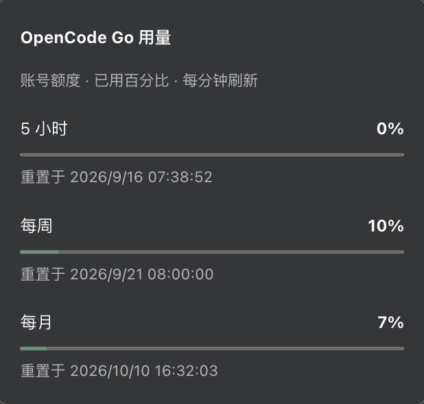

# dsh-opencode-go

[English](README.en.md)

功能：让你在 [DeepSeek Harness](https://github.com/deepseek-ai/deepseek-harness) 中完美使用 OpenCode Go 订阅模型，支持流式回复、工具调用和图片输入。

插件会自动添加 OpenCode Go 所需的会话请求头、读取网关模型目录，并显示订阅用量，仅需配置你的key

## 安装与使用

兼容清单：
 `0.1.5-rc.1`、`0.1.5-rc.2`、`0.1.6-alpha.1`、`0.1.6-alpha.2` 和 `0.1.7-alpha.1`

### 一键安装
```sh
dsh plugin --profile web add dsh-opencode-go@0.1.7
```

安装后启动或重启 `dsh web`，然后：

1. 打开 **设置 → OpenCode Go**。
2. 填入 OpenCode Go API Key 并保存。
3. 在会话的模型选择器中选择 OpenCode Go 模型。

### Headless

安装到 Headless profile：

```sh
dsh plugin --profile headless add dsh-opencode-go@0.1.7
```

将以下内容保存为 `headless.patch.yml`，选择默认模型：

```yaml
- id: agent-default-model
  config:
    provider: opencode-go
    model: deepseek-v4.1-flash
```

在 Bash 或 Zsh 中读取 API Key，然后运行任务：

```sh
read -s OPENCODE_API_KEY
export OPENCODE_API_KEY
dsh --profile headless --patch ./headless.patch.yml "你好"
```

模型 ID 须在当前网关目录中可用。Web 和 Headless 使用各自的 profile，需要分别安装插件。

如需从源码构建并安装本地包：

```sh
npm ci --legacy-peer-deps
npm pack
dsh plugin --profile web add ./dsh-opencode-go-0.1.7.tgz
```

开发依赖包含多代 DSH 的真实测试包，安装时需要 `--legacy-peer-deps`。Headless 用户将 `web` 换成 `headless`。

## 模型容量设置

Web 用户可在 **设置 → OpenCode Go** 中，从左侧模型列表选择模型，在右侧配置容量。高级设置位于右上角，默认收起。页面可以：

- 搜索模型名称或 ID，筛选近七天发布、已自定义或过时模型。
- 设置 **上下文窗口** 和 **最大输出**。
- 查看目录公布的容量作为参考。
- 对单个模型点击 **使用目录值**，或清除全部覆盖。

留空的字段会继承目录值。填写的正整数会直接传给适配器，不会被插件自动限制到提供方能力以内；超过上游真实能力的值可能被网关拒绝。修改会跟随设置页的 **Save** / **Discard** 流程，并在下一次请求或模型读取时生效，无需重启。

列表仅显示 Go 网关 `/models` 返回的模型；不会因为 models.dev 或本地容量配置保留了某个 ID 而额外显示它。NEW 依据 models.dev 的 `release_date` 按 UTC 日历日计算，近七天发布的模型排在前面；缺失日期不推测。已弃用依据 models.dev 的 `status: deprecated`，在设置列表中置底，但仍可配置和调用。

**在会话中显示过时模型** 默认关闭。打开后，网关仍提供的过时模型立即加入会话模型选择列表，无需额外保存。关闭只隐藏选择项，不中断已有会话对这些模型的调用。配置字段为 `showDeprecatedModels: false`；它独立于容量的保存／放弃操作。

Headless 或 profile patch 也可以直接配置 `modelLimits`：

```yaml
- id: opencode-go
  config:
    modelLimits:
      deepseek-v4.1-flash:
        contextWindow: 262144
        maxTokens: 32768
```

每个模型可以只设置其中一个字段；没有设置的字段沿用已有配置，无已有配置时使用目录值。`maxTokens` 同时约束显式请求的输出预算，较小的请求预算会保留。

在分层配置中，将某个模型或字段设为 `null` 可明确恢复在线目录值，即使下层 profile 已有覆盖。Web 的清空和“使用目录值”操作会自动保存这个标记。容量修改保留已获取的原始目录缓存，目录参考值始终显示上游公布的容量。

DSH `0.1.5` / `0.1.6` 通过旧设置接口保存；`0.1.7-alpha.1` 通过 profile 配置接口保存。五个受支持版本均无需重启即可生效。

## 升级插件

更新 Web profile 中的插件到 npm 最新版本：

```sh
dsh plugin --profile web update dsh-opencode-go --latest
```

完成后重启 `dsh web` 并刷新浏览器。Headless 用户将 `web` 换成 `headless`；如果两个 profile 都安装了插件，需要分别升级。

## 订阅用量显示



## 常见问题

### 升级到 DSH 0.1.7 后的高级设置

DSH `0.1.7` 将设置改存到当前 profile 的 `cordis.patch.yml`，本插件的条目 ID 为 `opencode-go`；旧宿主继续使用 `settings.yaml` 中的 `llm-opencode-go` 分区。API Key 仍由 credentials 服务保存。

上游的一次性设置导入无法自动把第三方插件的旧分区名映射到不同的条目 ID。如果升级后高级配置恢复默认值，可从 DSH home 下的 `settings.yaml.imported`（尚未导入时为 `settings.yaml`）找到 `llm-opencode-go`，在新设置页重新保存其中的配置；也可以将这些字段合并到目标 profile 的已有条目中，保留其他配置：

```yaml
- id: opencode-go
  config:
    # 将旧 llm-opencode-go 分区中需要保留的字段放在这里
    apiKeyEnv: OPENCODE_API_KEY
    refreshMinutes: 60
```

如果使用了自定义 API Key 引用，须保留原来的 `apiKeyEnv` 值。Web 和 Headless 的配置现在各自独立。

### DSH 0.1.5 安装插件后无法启动

插件 `0.1.0`–`0.1.4` 使用了 DSH `0.1.6` 新增的图片接口，在旧版 DSH 上可能出现 `IMAGE_OFFLOAD_REQUIRED_CODE` 导出不存在的启动错误。升级插件到 `0.1.5` 或更新版本后重启即可：

```sh
dsh plugin --profile web add dsh-opencode-go@0.1.7
```

Headless 用户将 `web` 换成 `headless`。修复保留了两版宿主的图片处理方式：DSH `0.1.5` 在请求超过图片预算时将最旧图片转成占位文本，DSH `0.1.6` 继续由宿主记录并处理图片卸载。

### 提示 `opencode-go` 路由已被占用

同一 profile 中只能有一个适配器提供 `opencode-go` 路由。如果已经通过其他插件或通用 pi-ai 配置接入 OpenCode Go，请先停用那一项配置。其他提供方可以继续使用。

### 没有出现预期的模型

先确认插件已启用且 API Key 已配置，再刷新设置页中的模型列表。插件每次读取模型列表都会请求网关 `/models`，并同步 [models.dev 的 OpenCode Go 配置](https://models.dev/api.json)。模型的协议、上下文长度、输出上限和图片能力来自在线配置，新模型无需等待本插件或 pi-ai 发布新版本。

网关和在线配置已收录、且使用 Anthropic Messages、OpenAI Chat Completions 或 OpenAI Responses 协议的新模型，在下次读取或刷新列表时即可使用。刷新会绕过已有会话的目录缓存；直接请求尚未缓存的新模型也会立即重新同步。设置页显示完整模型列表。

网关已公布 ID 但尚无有效协议/能力配置的模型会在设置页的发现结果中标注配置暂不可用，暂不进入对话模型选择器，避免一个未配置的模型阻断整个列表；直接调用时会说明原因。配置补齐后，刷新列表即可使用。仅凭模型 ID 无法可靠推断调用方式。上游新增全新协议或协议特例时，仍可能需要适配。

模型具有推理能力但没有可调节的推理档位时（如 `union-alpha`），仍可正常选择和使用，只是不显示推理强度选项。

在线配置暂时不可达时，优先复用本次运行中成功获取的配置，以 pi-ai 内置配置作为备用。网关目录不可达时，已有请求可以使用上次目录；设置页刷新会显示失败，避免把旧目录误认为最新结果。`refreshMinutes` 只控制已有模型请求的缓存时长，不阻止主动读取列表获取新模型。

## 功能说明

- **会话请求头**：每次请求包含 Harness User-Agent 和 `x-opencode-session`。同一会话保持相同 ID，无会话 ID 的请求使用独立随机值。
- **流式与历史**：支持流式输出、工具调用及历史回放，协议请求由 pi-ai 执行。
- **图片输入**：支持目录中声明图片能力的模型，需要 DSH attachment 服务。
- **模型容量覆盖**：可按模型覆盖上下文窗口和最大输出，空值继承在线目录。
- **提示与缓存**：插件不增加隐藏系统提示；会话 ID 用于网关路由。

## 卸载

从对应 profile 移除插件，再重启应用：

```sh
dsh plugin --profile web remove dsh-opencode-go
# 或
dsh plugin --profile headless remove dsh-opencode-go
```

## 反馈

遇到 bug 或有功能建议请提 issue。

## 许可证

[MIT](LICENSE)
